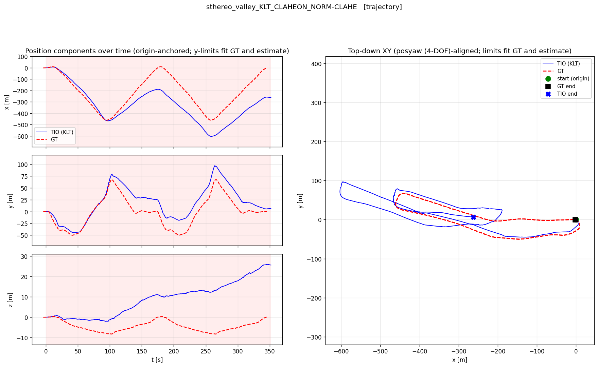
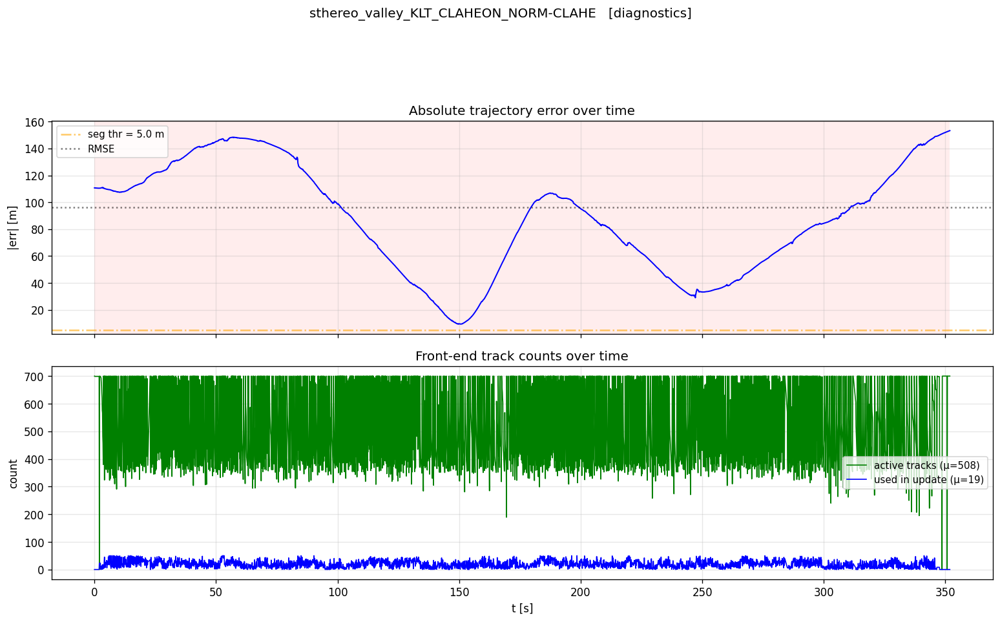

# Monocular Thermal-Inertial Odometry (mTIO)

Monocular MSCKF-based thermal-inertial odometry, evaluated across an RGB sanity-check baseline and three thermal datasets spanning indoor/outdoor flight and ground-vehicle driving.

## Problem

Visual-inertial odometry degrades in visually challenging conditions — smoke, darkness, low texture — precisely where a robot most needs reliable state estimation. Long-wave infrared is a candidate sensor there, because it images emitted heat rather than reflected light. This work builds a monocular thermal-inertial pipeline and characterises where it holds and where it breaks. The contribution is not a new algorithm but a reproducible evaluation harness that decouples three layers — preprocessing, front-end (KLT / ORB), and back-end (MSCKF) — and runs the same filter against multiple datasets with a **single shared parameter set**, so that differences in tracking performance are attributable to the data rather than to per-dataset tuning.

## Results

Best configuration: **KLT front-end, CLAHE enabled, normalise→CLAHE preprocessing order**, on the SThereo `valley_evening` ground-vehicle sequence — the only sequence tracked end-to-end. ZUPT is disabled in all reported results.



*Left: position components over time. Right: top-down XY after 4-DOF (posyaw) alignment. Ground truth dashed red, estimate blue.*

| Quantity | Value |
|---|---|
| GT path length | 2014 m |
| ATE RMSE (4-DOF posyaw alignment) | **96.4 m — 4.8 % of path length** |
| Estimated path length | 1673 m → ratio **0.83** (scale under-estimated by ~17 %) |
| Aligned endpoint error | 157 m |

Relative pose error from `evo` (`translation_part`, `all_pairs=False`), normalised by segment length:

| Segment length δ | Normalised RPE [m/m] |
|---|---|
| 1 m | 0.771 |
| 10 m | 0.448 |
| 50 m | 0.387 |
| 100 m | 0.349 |

> **Caveat on the δ = 1 m row.** GT poses in SThereo are spaced 1.30 m apart at the median, so a 1 m segment sits *below* the ground-truth sampling resolution. That row is resolution-limited rather than a true per-metre error, and should not be read as a short-range accuracy figure. The 10 / 50 / 100 m rows are the meaningful ones.

Normalised RPE falls monotonically as δ grows, which separates short-baseline jitter from systematic drift: over longer segments the per-metre error settles, so the error is not dominated by frame-to-frame noise. Read together with the 17 % scale deficit, the dominant error sources are **scale and orientation drift, not front-end tracking failure** — a conclusion the front-end diagnostics support directly.



*Top: absolute trajectory error over time against the RMSE line. Bottom: front-end track counts — mean 508 active tracks, of which a mean of 19 pass the χ² gate and enter the filter update.*

### Other datasets

| Dataset | Outcome |
|---|---|
| **SThereo** (ground vehicle, thermal) | Tracked end-to-end — the result reported above |
| **ROVTIO** (indoor UAV, thermal) | Tracked over certain intervals, then diverged |
| **FIReStereo** (outdoor UAV, thermal) | Never established tracking — diverged immediately |
| **EuRoC** (indoor UAV, visible) | Visible-spectrum sanity check on the back-end, not a thermal result |

**AerialTN** was integrated into the harness but excluded from the reported results, owing to an unresolved IMU axis-convention discrepancy that could not be reconciled with the rest of the pipeline. Reporting a trajectory from a sequence whose IMU frame is not trusted would not be a meaningful comparison.

## Evaluation method — 4-DOF (posyaw) alignment

ATE here is computed after an alignment I implemented myself, over **position and yaw only** (4 DOF), rather than the usual full SE(3) or Sim(3) alignment.

The reason is that in a visual-**inertial** system, roll and pitch are observable: the accelerometer measures the gravity vector, which fixes the two tilt angles against an absolute reference. Scale is likewise observable through the accelerometer. An SE(3) alignment is free to rotate the estimate in roll and pitch to minimise error, which silently absorbs real, observable tilt error into the alignment and flatters the result. Global position and yaw are the genuinely unobservable directions, so those — and only those — are what the alignment should be allowed to remove.

`evo` offers SE(3) and Sim(3) but not posyaw, so the 4-DOF alignment is implemented in `mTIO/evaluation.py`; `evo`'s SE(3) APE is retained purely as a cross-check that the implementation behaves as expected on the same trajectories.

## Pipeline

```
Thermal PNG ─┐                          ┌─ KLT optical flow ─┐
             ├─ ThermalDataLoader       │                    │
IMU CSV   ─┐ │  (undistort → Gaussian  ─┤                    │
           └─┤   denoise → percentile   └─ ORB descriptor ───┤
GT        ───┤   normalise → CLAHE)                          │
             │           active / dead feature tracks        │
             │                                               ▼
             │                                   ┌── MSCKF back-end ──┐
             ▼                                   │ predict  (IMU, FEJ)│
  VIOSequencer (chronological IMU + cam events) ►│ augment_state      │
                                                 │ triangulate (GN)   │
                                                 │ parallax + χ² gates│
                                                 │ sequential EKF upd.│
                                                 │ prune cam_states   │
                                                 └────────┬───────────┘
                                                          ▼
                                             {pose, velocity, biases}
                                                          │
                                                          ▼
                                     posyaw ATE · evo RPE · survival · NIS/df
```

Two back-end design choices worth calling out:

- **FEJ (First-Estimate Jacobians)**: every Jacobian is linearised at each state's frozen first estimate while the residual uses the current estimate. This keeps the unobservable directions (global position and yaw) consistent and stops a spurious yaw-drift feedback loop that a naive EKF-MSCKF exhibits.
- **Sequential per-track update**: each accepted track updates the covariance individually rather than being stacked into one large measurement. Batching hundreds of tracks in a single step shrank the covariance so aggressively that the next update's χ² gate rejected everything (a "chi-square cascade"), collapsing the filter to pure IMU dead-reckoning.

Alongside ATE and RPE, each run records **survival time** (run start to the divergence instant), **NIS/df** (time-averaged normalised innovation squared per DOF over χ²-accepted tracks; ≈ 1 indicates a consistent filter) and **average active / used track counts** as a front-end health check. All runs append a row to `results/all_runs.csv` for cross-dataset table generation.

## Quick start

```bash
python3 -m venv .venv
source .venv/bin/activate
pip install -r requirements.txt
pip install -e src/mTIO

# Extract a dataset bag to the flat layout, then run its test script.
python3 scripts/extract_rovtio_bag.py --bag-dir ~/Downloads/alt1 --out ~/rovtio_data/processed/alt1
python3 scripts/test_msckf_tio_rovtio.py
```

Each test script propagates the MSCKF over the whole run, computes the metrics above, saves a trajectory figure and a diagnostics figure, and appends one row to `results/all_runs.csv`. Every test script shares the same knobs, read from the environment at import time:

| Variable | Values | Meaning |
|---|---|---|
| `TVIO_METHOD` | `orb` (default) / `klt` | feature front-end |
| `TVIO_USE_CLAHE` | `0` / `1` | contrast enhancement on/off |
| `TVIO_DL_VER` | `1` / `2` | preprocessing order: `1` = CLAHE→normalise, `2` = normalise→CLAHE (adopted) |
| `TVIO_LIVE_PLOT` | `0` (default) / `1` | live matplotlib view vs. silent run + saved PNG |

```bash
TVIO_METHOD=klt TVIO_USE_CLAHE=1 TVIO_DL_VER=2 python3 scripts/test_msckf_tio_sthereo.py
```

`scripts/run_all_tests.py` sweeps (front-end × CLAHE × ordering) across every dataset.

## Repository layout

```
scripts/          bag extractors (ROS1 .bag → flat PNG + IMU CSV + GT), one test script
                  per dataset, the sweep runner, an evo re-evaluation entry point and
                  figure-generation scripts
src/mTIO/   config_<dataset>.py, common_params.py  calibration, IMU noise, GT
                  dataloader.py / dataloader2.py         preprocessing + VIOSequencer
                  klt.py / orb.py                        thermal-tuned front-ends
                  msckf.py                               the filter (FEJ, sequential upd.)
                  evaluation.py                          posyaw ATE, evo RPE, plots, CSV
docs/figures/     figures used in this README
results/, data/   generated outputs and raw bags — both gitignored
```

## Datasets

| Dataset | Modality | GT type | Platform | Source |
|---|---|---|---|---|
| EuRoC MH_03_medium | 8-bit grayscale (visible) | Vicon mocap | UAV indoor | [ETH ASL](https://projects.asl.ethz.ch/datasets/doku.php?id=kmavvisualinertialdatasets) |
| FIReStereo frick_1 | 16-bit thermal (Boson+) | LiDAR-inertial (pseudo-GT) | UAV outdoor | [GitHub](https://github.com/CMU-Wilderness/FireStereo) |
| ROVTIO alt1 | 16-bit thermal (Tau2) | Vicon mocap | UAV indoor | [HuggingFace](https://huggingface.co/datasets/ntnu-arl/rovtio) |
| SThereo valley_evening | 14-bit thermal | Local-pose (pseudo-GT) | Ground vehicle | [Project site](https://sites.google.com/view/sthereo) |
| AerialTN | 8-bit thermal (Boson+, H.264-decoded) | PX4 EKF2 / GPS | UAV outdoor | private bag, not publicly released |

EuRoC is a visible-light, non-thermal baseline: it validates that the MSCKF back-end itself is correct, so that degradation on the thermal datasets is attributable to the thermal modality rather than to an implementation fault. AerialTN files are named `*_voxlbag.*` in the code, after the VOXL bag format the sequence was recorded in.

## License

MIT — see [LICENSE](LICENSE).
