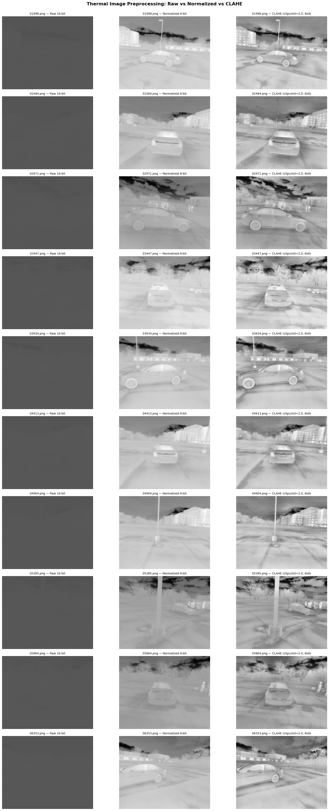
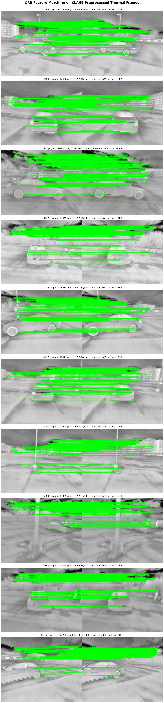
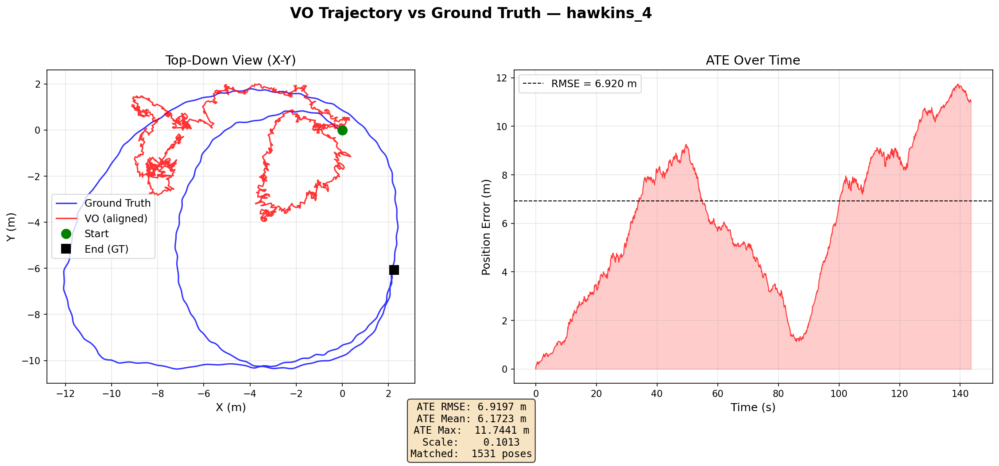

# Thermal Visual-Inertial Odometry (TVIO)

Monocular visual odometry pipeline for thermal camera imagery, built with ROS2 Humble and OpenCV. Evaluated on the [FireStereo](https://github.com/CMU-Wilderness/FireStereo) dataset.

## Project Structure

```
tvio_ws/
├── src/vo_baseline/          # ROS2 C++ package
│   └── src/
│       ├── image_publisher_node.cpp            # Reads 16-bit thermal PNGs, publishes to ROS topic
│       ├── thermal_preprocessor_node.cpp       # CLAHE preprocessing (16-bit → 8-bit)
│       ├── orb_vo_node.cpp                     # ORB feature matching + monocular VO
│       ├── orb_tracker_node.cpp                # Simple ORB detection test node
│       └── *_explained.md                      # Line-by-line code explanations (Turkish)
├── scripts/
│   ├── evaluate_trajectory.py                  # VO vs GT comparison (Sim(3) alignment, ATE)
│   ├── visualize_preprocessing.py              # Raw vs Normalized vs CLAHE comparison
│   └── visualize_orb_matching.py               # ORB feature matching visualization
└── results/                                    # Output plots
```

## Thermal VO Baseline

### Pipeline

```
16-bit Thermal PNG → image_publisher_node → /camera/thermal/image_raw
                                                      ↓
                                        thermal_preprocessor_node
                                        (normalize + CLAHE)
                                                      ↓
                                          /camera/thermal/image_clahe
                                                      ↓
                                              orb_vo_node
                                        (ORB → BFMatcher → Essential Matrix
                                         → recoverPose → pose accumulation)
                                                      ↓
                                          /vo/odometry, /vo/path
                                          + TUM trajectory file
```

### Preprocessing

16-bit thermal images are converted to 8-bit using min-max normalization followed by CLAHE (Contrast Limited Adaptive Histogram Equalization, clipLimit=2.0, tileGrid=8x8). This enhances local contrast while suppressing noise, which is critical for feature detection on low-texture thermal imagery.



### Feature Extraction & Matching

ORB (1000 keypoints) with BFMatcher (Hamming distance, cross-check). Best 60% of matches are kept after distance-based sorting. Lens distortion is corrected before geometric estimation.



### Pose Estimation

- `findEssentialMat` (RANSAC, confidence=0.999) computes the Essential Matrix
- `recoverPose` extracts rotation and translation (unit scale)
- Cumulative pose: `T_world = T_world * T_relative`

### Camera Parameters

From `firestereo.yaml` (radtan distortion model):
| Parameter | Value |
|-----------|-------|
| fx | 406.33 |
| fy | 406.95 |
| cx | 311.51 |
| cy | 241.76 |
| k1, k2 | -0.3495, 0.1038 |
| p1, p2 | -0.0001474, -0.0001834 |

### Evaluation

Ground truth from LiDAR-SLAM reconstruction (`reconstruction/hawkins_run4_car/traj.txt`). Trajectories are aligned using Sim(3) (Umeyama method) to account for monocular scale ambiguity.

**Results on hawkins_4:**

| Metric | Value |
|--------|-------|
| Matched Poses | 1526 |
| Scale Factor | 0.1014 |
| ATE RMSE | 5.24 m |
| ATE Mean | 5.05 m |
| ATE Max | 8.85 m |



### Known Limitations

- **Scale ambiguity**: Monocular VO cannot recover absolute scale. Translation vectors are unit length.
- **Rotation sensitivity**: Drift accumulates significantly during rotational motions — a fundamental limitation of monocular VO with Essential Matrix decomposition.
- **Low texture**: Thermal images have fewer distinctive features compared to RGB, leading to fewer reliable matches.

## Build & Run

### Prerequisites
- ROS2 Humble
- OpenCV 4.x
- cv_bridge

### Build
```bash
cd ~/tvio_ws
colcon build
source install/setup.bash
```

### Run (3 terminals)
```bash
# Terminal 1: Publish images
ros2 run vo_baseline image_publisher_node --ros-args \
  -p image_dir:=/path/to/firestereo/hawkins_4/img_left \
  -p timestamp_file:=/path/to/firestereo/hawkins_4/timestamps.txt

# Terminal 2: Preprocessor
ros2 run vo_baseline thermal_preprocessor_node

# Terminal 3: Visual Odometry
ros2 run vo_baseline orb_vo_node
```

### Evaluate
```bash
python3 scripts/evaluate_trajectory.py
```

## Dataset

[FireStereo](https://github.com/CMU-Wilderness/FireStereo) — Forest infrared stereo dataset for UAS depth perception in visually degraded environments. Sequence used: `hawkins_4` (2478 thermal images, 640x512, 16-bit).

---

## Thermal VIO
